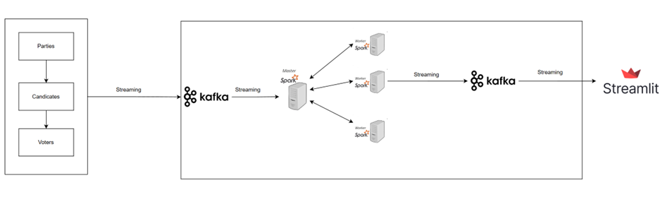

# Voting System with Spark, Kafka, and Streamlit

This project is a real-time voting system built using Python, Apache Kafka, Apache Spark, and Streamlit. It allows users to vote for candidates, processes the data in real time, and displays results in a dynamic dashboard.

---

## Prerequisites

1. **Python**: Ensure Python 3.8 or later is installed.
2. **Kafka**: Install Apache Kafka.
3. **Java**: Install Java 8 or later (required by Kafka).
4. **Spark**: Install Apache Spark (compatible with your Python version).

---

## Installation

### 1. Install Python Requirements

1. Clone this repository:

   ```bash
   git clone <repository-url>
   cd <repository-name>
   ```

2. Install dependencies:
   ```bash
   pip install -r requirements.txt
   ```

### 2. Install and Set Up Kafka

1. Download and extract Kafka:

   ```bash
   wget https://downloads.apache.org/kafka/<version>/kafka_<version>.tgz
   tar -xvzf kafka_<version>.tgz
   cd kafka_<version>
   ```

2. Start Zookeeper:

   ```bash
   bin/zookeeper-server-start.sh config/zookeeper.properties
   ```

3. Start Kafka broker:

   ```bash
   bin/kafka-server-start.sh config/server.properties
   ```

4. Create Kafka topics:
   ```bash
   bin/kafka-topics.sh --create --topic voting --bootstrap-server localhost:9092 --partitions 1 --replication-factor 1
   bin/kafka-topics.sh --create --topic result --bootstrap-server localhost:9092 --partitions 1 --replication-factor 1
   ```

---

## Running the Application

### 1. Start the Spark Processor

This script processes voting data from Kafka's `voting` topic and sends the results to the `result` topic.

Run the following command in the project directory:

```bash
python spark_voting_processor.py
```

### 2. Start the Streamlit Dashboard

This script reads results from Kafka's `result` topic and displays them as a real-time chart.

Run the following command:

```bash
streamlit run streamlit_voting.py
```

---

## How It Works

1. **Voting**: Users vote by interacting with a web interface.
2. **Kafka**: Votes are sent to Kafka's `voting` topic.
3. **Spark**: Processes votes from the `voting` topic and calculates results in real-time.
4. **Streamlit**: Displays the results fetched from Kafka's `result` topic.

---

## System Architecture


